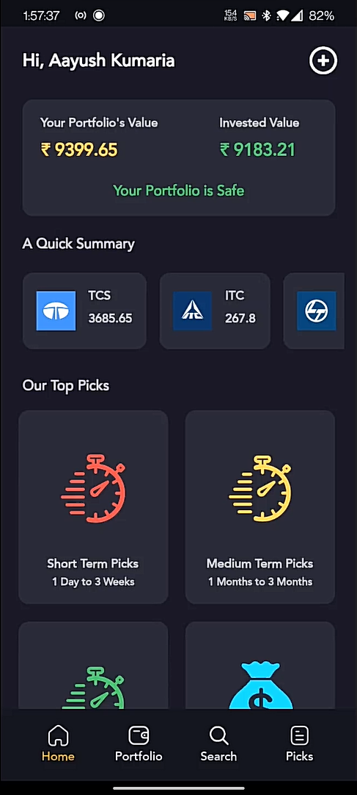
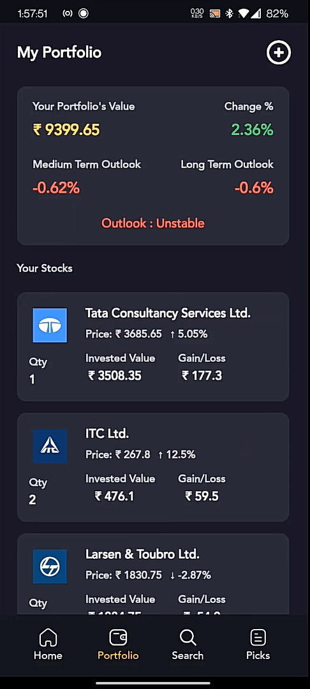
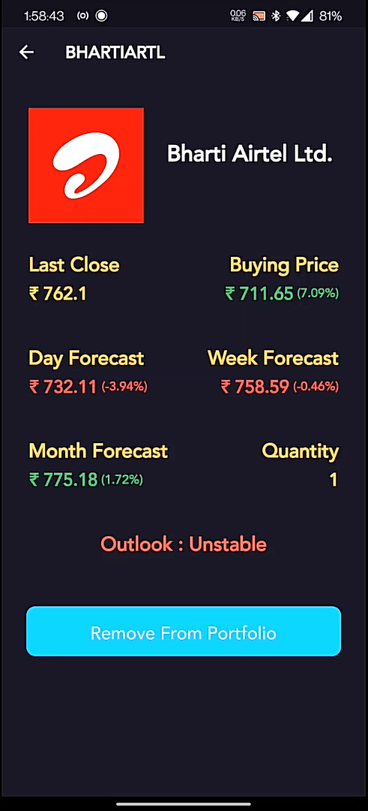
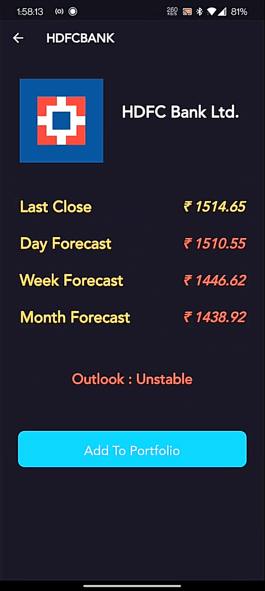
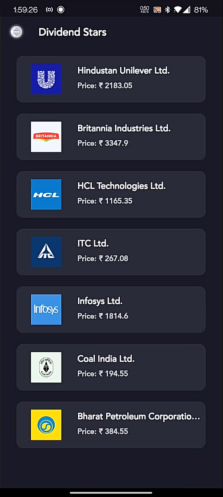

# Folio - A Smarter Way To Manage Your Portfolio 

  

**Folio** is an application that tracks the health of your Stock Portfolio and Forecasts it for a Short, Medium and Long Term hence giving you deeper understanding of how safe your money is. 

Picking Stocks can be hard and so **Folio** auto-predicts the Day, Week, and Month closing of the Top 50 Stocks of India Listed on _NSE_. 

To simplify it, **Folio** answers the following questions:
 - How safe is my Portfolio?
 - Is this the correct time to Book Profits?
 - Should I Buy a particular stock?
 - Which stock will perform well in a particular timeframe?

## TechStack

**Folio** is built on 3 primary technologies.
 -  Flutter
	 - Our application is capable of running on Android / iOS devices since it is created on Flutter which is Written in Dart.
	 - The App Size does not exceed 20mb since most of the storage is done by a server.

 - Django
	 - We have created a Django Based Server that can serve the application on any device. 
	 - Using Port Forwarding, our Django Server does not run on a localhost but a hosted host. (I found this funny)
	 - Django handles the Database (SQLITE3) and houses the state of the art Deep Learning Algorithm

- Deep Learning
	- Our Deep Learning Algortihm is something that has never been created and the proof lies in the 50 Research Papers we have reviews ['Research Papers - Index'](https://docs.google.com/spreadsheets/d/1WH90C9-OXOcXIn6yAq-UbXmckZ0kxveH2B-ANV-Uf44/edit?usp=sharing)
	- It takes into account Open, High, Low, Close, Volume Traded, VWAP, 50DMA, 100DMA, 14 Day RSI, and Volatility.
	- Almost enacts a real life trader.
	- Super proud of my model 🥲

## How to Setup the Server

- Navigate to Dot-Tech---Folio/Backend/folio/
- In the terminal type the following command to install the dependencies
	> pip install -r requirements.txt
- Take a coffee break while everything installs
- In the same directory type 
	> python manage.py runserver

You might want to use port forwarding to convert a localhost to hosted host. (Still Funny)

- With the server running, navigate to Dot-Tech---Folio/Frontend/folio/
- Replace the Server link with your server link but DO NOT remove the /api/
- In The Terminal type:
  > flutter build apk --release
- Don't Forget to transfer some money to us too.

## For You? For Me?

Folio is made for the New Investors and Traders in the Stock Market.  
___When I was a kid, I had the money. I had the account. I had the means. But I did not know where to invest.___  
That's what we are trying to eliminate. 

## Some Images (Because Why Not?)

  
  
  
  
  

